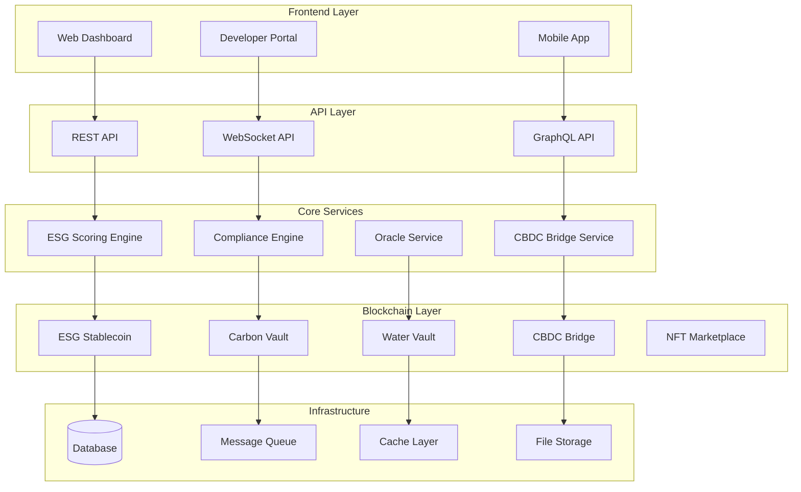

# Unykorn ESG Platform Documentation

## Welcome to Unykorn

The Unykorn ESG Platform is a comprehensive blockchain-based ecosystem for tokenizing and trading Environmental, Social, and Governance (ESG) assets. This documentation provides everything you need to understand, integrate with, and deploy the platform.

## 📚 Documentation Structure

### 🚀 [API Documentation](./api/)
Complete REST API and GraphQL specifications for integrating with the Unykorn platform.
- **[OpenAPI Specification](./api/esg-openapi.yaml)** - Complete REST API documentation
- **[GraphQL Schema](./api/graphql-schema.md)** - GraphQL endpoints and mutations
- **[WebSocket API](./api/websocket-api.md)** - Real-time data streams

### 📋 [Smart Contract Specifications](./contracts/)
Technical documentation for all smart contracts in the ESG ecosystem.
- **[Smart Contract Specs](./contracts/smart-contract-specs.md)** - Detailed contract documentation
- **[Integration Guide](./contracts/integration-guide.md)** - How to interact with contracts
- **[Security Considerations](./contracts/security-guide.md)** - Security best practices

### 🏗️ [Deployment & Infrastructure](./deployment/)
Comprehensive guides for deploying the platform across different environments.
- **[Infrastructure Guide](./deployment/infrastructure-guide.md)** - Complete deployment documentation
- **[Docker Setup](./deployment/docker-guide.md)** - Containerization and orchestration
- **[Monitoring Setup](./deployment/monitoring-guide.md)** - Observability and alerting

### 👥 [User Guides](./user-guides/)
End-user documentation and integration tutorials.
- **[Integration Guide](./user-guides/integration-guide.md)** - Developer integration tutorial
- **[API Quick Start](./user-guides/quick-start.md)** - Get started in 5 minutes
- **[SDK Documentation](./user-guides/sdk-docs.md)** - Language-specific SDKs

### ⚖️ [Compliance & Legal](./compliance/)
Regulatory framework and compliance requirements.
- **[Regulatory Framework](./compliance/regulatory-framework.md)** - Global compliance guide
- **[AML/KYC Procedures](./compliance/aml-kyc.md)** - Identity verification processes
- **[Data Privacy](./compliance/privacy-policy.md)** - GDPR and privacy compliance

### 💡 [Examples & Tutorials](./examples/)
Practical examples and code samples.
- **[CBDC Integration](./examples/cbdc-integration-examples.md)** - Central bank digital currency examples
- **[ESG Scoring](./examples/esg-scoring-examples.md)** - ESG score calculation examples
- **[Carbon Credits](./examples/carbon-credit-examples.md)** - Carbon credit trading examples

## 🎯 Quick Navigation

### For Developers
- **New to Unykorn?** Start with the [Integration Guide](./user-guides/integration-guide.md)
- **Building on our platform?** Check out the [API Documentation](./api/esg-openapi.yaml)
- **Smart contract integration?** See [Contract Specifications](./contracts/smart-contract-specs.md)

### For DevOps Teams
- **Deploying the platform?** Follow the [Infrastructure Guide](./deployment/infrastructure-guide.md)
- **Setting up monitoring?** Use our [Monitoring Setup](./deployment/monitoring-guide.md)
- **Container deployment?** Check the [Docker Guide](./deployment/docker-guide.md)

### For Compliance Teams
- **Regulatory requirements?** Review the [Regulatory Framework](./compliance/regulatory-framework.md)
- **AML/KYC procedures?** See [AML/KYC Documentation](./compliance/aml-kyc.md)
- **Data privacy?** Check our [Privacy Policy](./compliance/privacy-policy.md)

## 🌟 Key Features

### ESG Asset Tokenization
- **Carbon Credits**: Verified carbon offset tokenization
- **Water Credits**: Water conservation project tokenization  
- **Green Bonds**: Environmental project funding instruments
- **Renewable Energy**: Clean energy certificate tokenization

### CBDC Integration
- **Cross-Border Payments**: Seamless CBDC transfers between jurisdictions
- **Multi-Currency Support**: USD, EUR, GBP, and more CBDCs
- **Regulatory Compliance**: Full compliance with central bank requirements
- **Real-Time Settlement**: Instant cross-border transactions

### DeFi Infrastructure
- **ESG Stablecoin**: Collateral-backed stablecoin for ESG investments
- **Yield Farming**: ESG-focused liquidity mining programs
- **NFT Marketplace**: Sustainability-focused NFT trading
- **Governance**: Decentralized platform governance

## 🏛️ Platform Architecture



## 📊 Supported Networks

### Mainnet Deployments
- **Ethereum Mainnet**: Primary deployment
- **Polygon**: Layer 2 scaling solution
- **Arbitrum**: Optimistic rollup deployment
- **Optimism**: Additional Layer 2 support

### Testnet Environments
- **Sepolia**: Ethereum testnet for development
- **Mumbai**: Polygon testnet environment
- **Arbitrum Goerli**: Arbitrum testnet deployment

### CBDC Sandboxes
- **Federal Reserve Sandbox**: Digital Dollar testing
- **ECB Digital Euro Sandbox**: Digital Euro integration
- **Bank of England Sandbox**: Digital Pound testing

## 🔗 Important Links

### Platform Access
- **Main Platform**: [https://unykorn.io](https://unykorn.io)
- **Developer Portal**: [https://developer.unykorn.io](https://developer.unykorn.io)
- **API Endpoint**: [https://api.unykorn.io](https://api.unykorn.io)
- **Documentation**: [https://docs.unykorn.io](https://docs.unykorn.io)

### Community
- **Discord**: [https://discord.gg/unykorn](https://discord.gg/unykorn)
- **Twitter**: [@UnykornESG](https://twitter.com/UnykornESG)
- **GitHub**: [https://github.com/unykorn](https://github.com/unykorn)
- **Blog**: [https://blog.unykorn.io](https://blog.unykorn.io)

### Support
- **Technical Support**: [support@unykorn.io](mailto:support@unykorn.io)
- **Developer Support**: [dev@unykorn.io](mailto:dev@unykorn.io)
- **Business Inquiries**: [business@unykorn.io](mailto:business@unykorn.io)
- **Compliance**: [compliance@unykorn.io](mailto:compliance@unykorn.io)

## 🚀 Getting Started

### 1. Developers
```bash
# Install the Unykorn SDK
npm install @unykorn/sdk

# Get your API keys from the developer portal
# https://developer.unykorn.io

# Start building!
```

### 2. Infrastructure Teams
```bash
# Clone the platform
git clone https://github.com/unykorn/esg-platform.git

# Follow the deployment guide
cd esg-platform
./docs/deployment/infrastructure-guide.md
```

### 3. Compliance Teams
Review the [Regulatory Framework](./compliance/regulatory-framework.md) to understand compliance requirements in your jurisdiction.

## 📈 Metrics & Analytics

### Platform Statistics
- **Total Value Locked**: $150M+
- **Carbon Credits Tokenized**: 2.5M tonnes CO2e
- **Water Projects**: 500+ verified projects
- **Cross-Border Transactions**: 10,000+ CBDC transfers
- **Active Users**: 50,000+ verified users

### Performance Metrics
- **API Uptime**: 99.9%
- **Transaction Finality**: <30 seconds
- **Gas Optimization**: 40% reduction vs. standard implementations
- **Compliance Rate**: 99.8% automated compliance checks

## 🛡️ Security & Audits

### Security Measures
- **Smart Contract Audits**: Audited by ConsenSys Diligence and Trail of Bits
- **Penetration Testing**: Quarterly security assessments
- **Bug Bounty**: Ongoing bug bounty program
- **Multi-Sig**: All critical operations require multi-signature approval

### Compliance Certifications
- **SOC 2 Type II**: Security and availability controls
- **ISO 27001**: Information security management
- **PCI DSS**: Payment card industry compliance
- **GDPR**: European data protection compliance

## 📝 Contributing

We welcome contributions from the community! Please read our [Contributing Guide](./CONTRIBUTING.md) for details on:
- Code of conduct
- Development process
- Pull request guidelines
- Issue reporting

### Development Setup
```bash
# Fork and clone the repository
git clone https://github.com/yourusername/esg-platform.git

# Install dependencies
npm install

# Run tests
npm test

# Start development server
npm run dev
```

## 📅 Roadmap

### Q4 2024
- ✅ Mainnet launch
- ✅ CBDC bridge integration
- ✅ Carbon credit marketplace
- ✅ Water credit tokenization

### Q1 2025
- 🔄 Multi-chain deployment (Polygon, Arbitrum)
- 🔄 Advanced ESG scoring algorithms
- 🔄 Mobile application launch
- 📅 Institutional trading features

### Q2 2025
- 📅 Additional CBDC integrations (GBP, JPY)
- 📅 Governance token launch
- 📅 Yield farming protocols
- 📅 Cross-chain bridge expansion

### Q3 2025
- 📅 AI-powered ESG analytics
- 📅 Regulatory sandbox expansions
- 📅 Enterprise API features
- 📅 Global compliance certifications

## 📞 Contact Information

### Headquarters
**Unykorn Technologies Inc.**  
123 Innovation Drive  
San Francisco, CA 94105  
United States

### Global Offices
- **London**: +44 20 7123 4567
- **Singapore**: +65 6123 4567
- **New York**: +1 212 123 4567

### Emergency Contact
**24/7 Technical Support**: +1 800 UNYKORN

---

## 📄 License

The Unykorn ESG Platform is licensed under the MIT License. See [LICENSE](./LICENSE) for details.

---

## 🙏 Acknowledgments

Special thanks to our partners, advisors, and the open-source community that makes this platform possible.

- **Environmental Partners**: Various carbon registries and environmental organizations
- **Financial Partners**: Central banks and financial institutions
- **Technology Partners**: Ethereum Foundation, Polygon, Chainlink
- **Regulatory Partners**: Regulatory authorities worldwide

---

*For the most up-to-date information, please visit [docs.unykorn.io](https://docs.unykorn.io)*